# Fiscal da Cota Parlamentar — Fullstack Architecture Document

## 1. Introduction
This document outlines the complete fullstack architecture for **Fiscal da Cota Parlamentar**, including data ingestion strategies, backend orchestration, and frontend implementation. It serves as the single source of truth for the technical implementation of the system.

### Change Log
| Date | Version | Description | Author |
| :--- | :--- | :--- | :--- |
| 2026-02-25 | 1.0 | Initial Fullstack Architecture Definition | @architect (Orion) |

---

## 2. High Level Architecture

### Technical Summary
The system follows a **Data-Driven Serverless** approach. A React/Vite frontend communicates with an API layer (Next.js or Supabase Edge Functions) that orchestrates calls between the "Dados Abertos" API and a PostgreSQL database (Supabase). A worker/sync layer handles the ingestion of large bulk CEAP files into optimized database tables for historical auditing.

### Platform and Infrastructure
**Platform:** Supabase + Vercel
**Key Services:** 
- PostgreSQL (Database)
- Edge Functions (API & Sync logic)
- Storage (Bulk file processing)
- Vercel (Frontend Hosting)

### High Level Architecture Diagram

```mermaid
graph TD
    User((Cidadão)) --> Web[Frontend: React/Vite]
    Web --> API[API: Supabase Edge Functions]
    API --> DB[(Supabase PostgreSQL)]
    API --> CamaraAPI[REST API Câmara dos Deputados]
    Sync[Sync Worker] --> CamaraBulk[CEAP Bulk CSV Files]
    Sync --> DB
    DB --> Cache[In-memory Cache Strategy]
```


---

## 3. Tech Stack

| Category | Technology | Version | Purpose |
| :--- | :--- | :--- | :--- |
| **Frontend Framework** | React + Vite | Latest | Fast, component-based UI |
| **Styling** | Vanilla CSS + Radix UI | Latest | Custom premium look & feel |
| **Charts** | Chart.js / D3.js | Latest | Financial data visualization |
| **Backend** | Supabase Edge Functions | - | Serverless API & Webhooks |
| **Database** | PostgreSQL | 15+ | Relational data, complex queries |
| **Language** | TypeScript | 5.0+ | Type safety across full stack |
| **Testing** | Vitest | Latest | Component and logic testing |

---

## 4. Data Models

### Deputy
**Purpose:** Stores metadata about parlamentares.
```typescript
interface Deputy {
  id: number;
  nome: string;
  siglaPartido: string;
  siglaUf: string;
  urlFoto: string;
  email: string;
  currentQuotaLimit: number; // Derived from UF table
}
```

### Expense
**Purpose:** Stores individual spending records retrieved from the API or Bulk files.
```typescript
interface Expense {
  id: string;
  deputadoId: number;
  tipoDespesa: string;
  valorDocumento: number;
  valorGlosado: number;
  valorLiquido: number;
  dataEmissao: string;
  nomeFornecedor: string;
  cnpjCpfFornecedor: string;
  tipoCnpjCpf: 1 | 2; // 1: CNPJ, 2: CPF
}
```

---

## 5. External APIs

### Câmara dos Deputados (Dados Abertos)
- **Base URL:** `https://dadosabertos.camara.leg.br/api/v2`
- **Endpoints:**
  - `GET /deputados`: List available deputies.
  - `GET /deputados/{id}/despesas`: Real-time expenses (last 6 months).
  - `Bulk Data`: Hourly/Monthly CSV files for historical series.
- **Constraints:** Rate limit applies. Cache headers must be respected.

---

## 6. Database Schema (PostgreSQL)

```sql
-- Tables
CREATE TABLE deputies (
    id SERIAL PRIMARY KEY,
    name TEXT NOT NULL,
    party TEXT,
    state CHAR(2),
    photo_url TEXT,
    metadata JSONB
);

CREATE TABLE expenses (
    id UUID PRIMARY KEY DEFAULT gen_random_uuid(),
    deputy_id INTEGER REFERENCES deputies(id),
    category TEXT,
    supplier_name TEXT,
    supplier_id TEXT, -- CNPJ or CPF
    supplier_type SMALLINT, -- 1-CNPJ, 2-CPF
    net_value NUMERIC(12,2),
    glosed_value NUMERIC(12,2),
    issue_date DATE,
    sync_source TEXT -- 'api' or 'bulk'
);

-- Indices for performance
CREATE INDEX idx_expenses_deputy_date ON expenses(deputy_id, issue_date);
CREATE INDEX idx_expenses_supplier ON expenses(supplier_id);
```

---

## 7. Unified Project Structure

```plaintext
fiscal/
├── .aios/                   # Framework Config
├── docs/                    # PRD, Architecture, Specs
├── src/
│   ├── apps/
│   │   ├── frontend/        # React/Vite App
│   │   │   ├── components/  # UI Elements (Charts, Cards)
│   │   │   ├── services/    # API Clients (Câmara SDK)
│   │   │   └── hooks/       # useExpenses, useDeputies
│   │   └── functions/       # Supabase Edge Functions
│   │       ├── sync-api/    # Daily cron job
│   │       └── auth/        # Optional auth logic
│   ├── packages/
│   │   ├── shared/          # Shared interfaces & types
│   │   └── constants/       # UF Quota Table
├── .env.example
├── package.json
└── README.md
```

---

## 8. Development Workflow

- **Local Development:** Run `npm run dev` for frontend.
- **Data Seed:** Initial `gh sync-data` command to populate local DB with `deputies` catalog.
- **Type Sharing:** All interfaces must be defined in `packages/shared`.

— Orion, orquestrando o sistema 🎯
