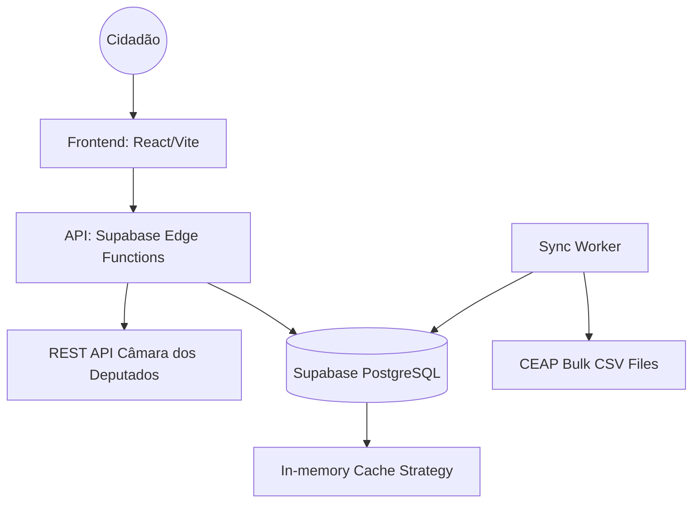

# High Level Architecture

## Technical Summary
The system follows a **Data-Driven Serverless** approach. A React/Vite frontend communicates with an API layer (Next.js or Supabase Edge Functions) that orchestrates calls between the "Dados Abertos" API and a PostgreSQL database (Supabase). A worker/sync layer handles the ingestion of large bulk CEAP files into optimized database tables for historical auditing.

## Platform and Infrastructure
**Platform:** Supabase + Vercel
**Key Services:** 
- PostgreSQL (Database)
- Edge Functions (API & Sync logic)
- Storage (Bulk file processing)
- Vercel (Frontend Hosting)

## High Level Architecture Diagram

