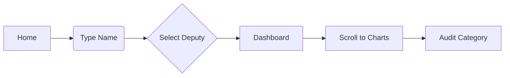

# Fiscal da Cota Parlamentar — UI/UX Specification

## 1. Introduction
This document defines the user experience goals, information architecture, user flows, and visual design specifications for **Fiscal da Cota Parlamentar**. It serves as the foundation for frontend development, ensuring a cohesive and transparency-focused interface.

### UX Goals & Principles
- **Clarity over Complexity:** Financial data should be simplified into intuitive charts.
- **Radical Transparency:** Every data point must be traceable to its source.
- **Accessibility by Default:** High-contrast and keyboard-navigable interface for all citizens.
- **Trust via Design:** Professional, neutral, and data-driven aesthetic.

### Target User Personas
- **The Vigilant Citizen:** Occasional user tracking their local representative's spending.
- **The Investigative Journalist:** Power user looking for anomalies across categories and temporal periods.
- **The Data Researcher:** Interested in bulk analysis and comparative rankings.

---

## 2. Information Architecture (IA)

### Site Map
```mermaid
graph TD
    A[Splash/Landing] --> B[Home / Search]
    B --> C[Deputy Profile Dashboard]
    C --> C1[Summary Cards]
    C --> C2[Category Charts]
    C --> C3[Monthly Timeline]
    C --> C4[Supplier Table]
    B --> D[Global Rankings (V2)]
    D --> D1[Top Spenders List]
    D --> D2[State Heatmap]
```

### Navigation Structure
- **Primary Navigation:** Simple Header with Search, Global Rankings, and About.
- **Secondary Navigation:** Tab-based navigation within the Deputy Profile (Overview, Expenses, Suppliers).

---

## 3. User Flows

### Flow: Search and View Deputy
**User Goal:** Find a specific deputy and check their latest gas spending.
**Entry Point:** Homepage Search Bar.
**Success Criteria:** Displaying the "Fuel & Lubricants" category in the deputy dashboard.



---

## 4. Key Screen Layouts

### Home / Search Screen
- **Hero:** Large, central search input with autocomplete.
- **Context:** Briefly explain the data source (Câmara dos Deputados).
- **Featured:** Cards for high-priority or trending alerts (e.g., "Deputies near the monthly limit").

### Deputy Dashboard
- **Profile Header:** Photo (left), Metadata (Party/UF/Role) in the center, and "Official Profile" link.
- **KPI Row:** Total Spent (Year), % of Yearly Quota, Total Glosado.
- **Analytics Row:** 
  - Left: Bar chart for Categories.
  - Right: Line chart for Monthly Trend.
- **Data Table:** Supplier list with sorting and "Alert" badges for CPF suppliers.

---

## 5. Branding & Style Guide

### Visual Identity
Professional, "Audit-like" feel. Uses a professional Dark Mode as the primary theme.

### Color Palette
| Color Type | Hex Code | Usage |
| :--- | :--- | :--- |
| **Primary** | #2563EB | Interactive elements, links |
| **Secondary** | #6B7280 | Secondary text, borders |
| **Background** | #0F172A | Main dark theme background |
| **Surface** | #1E293B | Cards and dashboard blocks |
| **Success** | #10B981 | Spending within limits |
| **Warning** | #F59E0B | Quota approaching 90% |
| **Error** | #EF4444 | Quota exceeded, glosed values |

### Typography
- **Primary Font:** Inter (Modern, highly readable for numbers).
- **Secondary:** Roboto Mono (Used for CNPJ/CPF and numeric amounts to ensure alignment).

---

## 6. Responsiveness
- **Mobile (375px - 600px):** Single column layout. Summary cards become a vertical stack. Charts are optimized for small widths.
- **Tablet (600px - 1024px):** Grid layout. Search and Header consolidate.
- **Desktop (1024px+):** Full dashboard with side-by-side analytics.

---

## 7. Performance & Animation
- **Data Loading:** Use skeleton screens while fetching API/Supabase data.
- **Micro-interactions:** Subtle hover states on chart bars showing tooltips with exact values.
- **Page Transitions:** Fade-in effect for dashboard modules.

---

## 8. Next Steps
1. **Architect:** Review this spec to choose the best graphing library (Chart.js recommended for Inter integration).
2. **Prototyping:** Generate AI-Frontend prompts (v0/Lovable) based on these layouts.

— Orion, orquestrando o sistema 🎯
